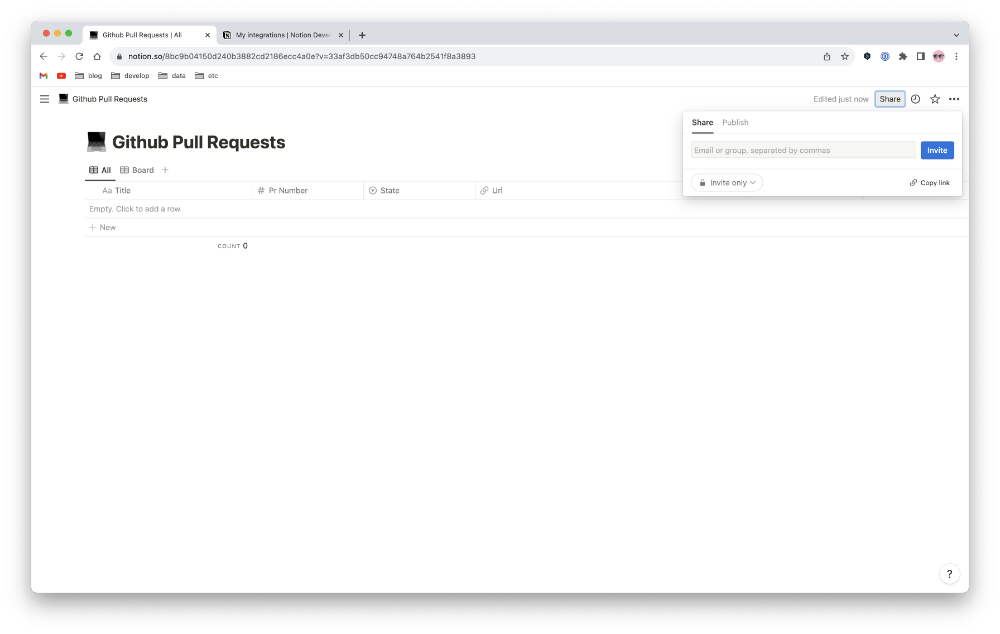

## Install

1. Duplicate Notion [template](https://stone-tangelo-0ab.notion.site/2079f2070233462bbfcd29c2436a763c?v=f13a771566c9490581fb6fb770b229df)

    

2. Make Notion [API key](https://www.notion.so/my-integrations)

    

3. Integrate & copy link (database url)

     

4. Generate Slack [incoming webhook token](https://slack.com/apps/A0F7XDUAZ-incoming-webhooks)

5. Set secrets

   - `GH_TOKEN`: Github token
   - `NOTION_DATABASE`: Notion database id (`https://www.notion.so/<id>}?v=...`)
   - `NOTION_TOKEN`: Notion API key
   - `SLACK_WEBHOOK`: Slack incoming webhook token
   - `SLACK_CHANNEL`: Slack channel

   

## Reference

- [Issue template example](https://github.com/forem/forem/blob/main/.github/ISSUE_TEMPLATE/bug_report.md)
- [PR template example](https://github.com/forem/forem/blob/main/.github/PULL_REQUEST_TEMPLATE.md)
- [Sync Github PRs to Notion](https://github.com/marketplace/actions/sync-github-prs-to-notion)
- [Slack Notify](https://github.com/marketplace/actions/slack-notify)